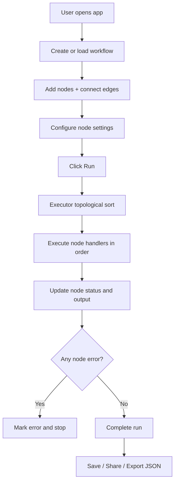
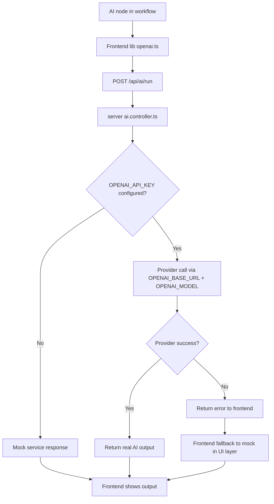
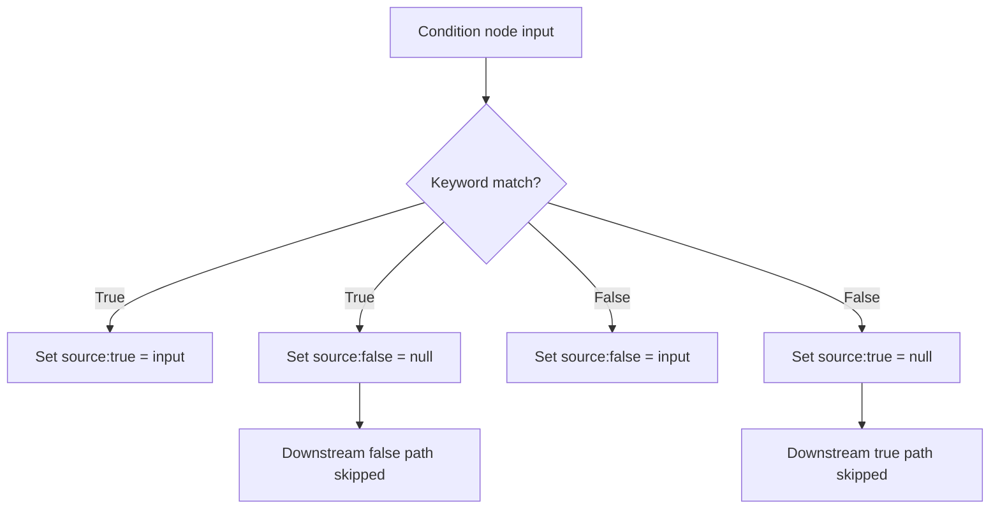
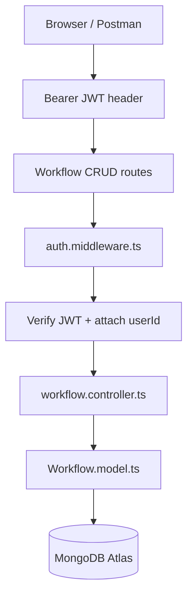
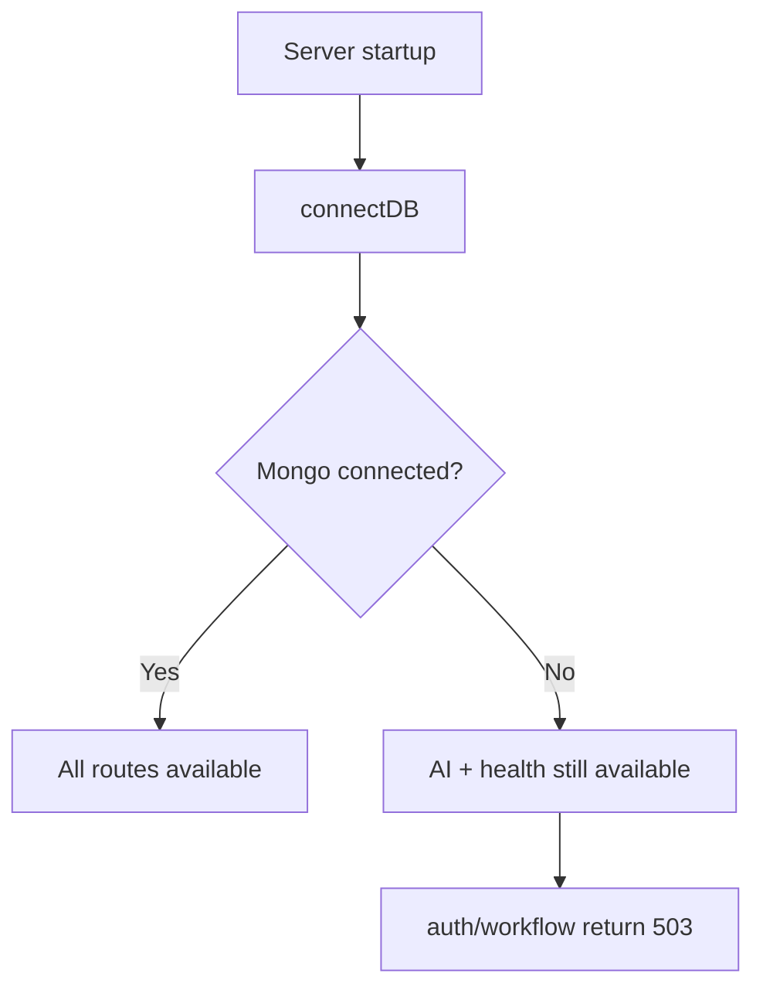

# AutoFlow Workflow Diagrams

Visual diagrams for the full app flow, backend flow, and AI execution.

## 1) End-to-End App Flow

## 2) AI Node Execution Flow

## 3) Condition Branching Flow

## 4) Backend Auth + Workflow CRUD Flow

## 5) Route Availability Flow

